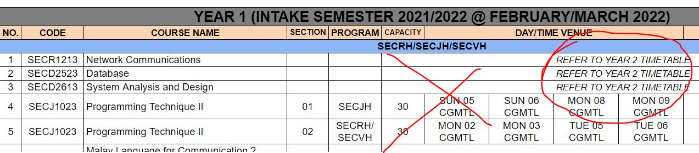
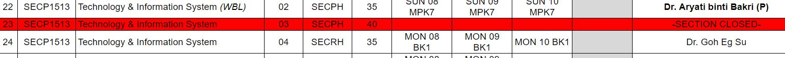
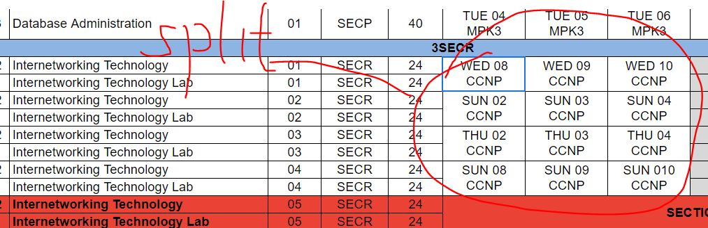
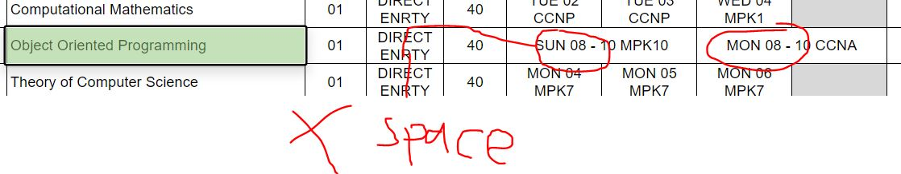
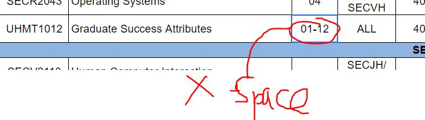

# UTM SoC Timetable Excel Parser

I had developed a timetable generator, but updating the school of computing courses involves manual labour where I have to key in every course's information from the excel file. Therefore, this python script serves to parse the excel file and generates a JSON file that is used by the timetable generator.

---
 

## **Excel Data Cleaning (IMPORTANT)**

It is easier to clean certain parts of the excel file in Excel itself than to handle certain cases in the python script. Here are the required cleaning that has to be done manually:

1. Remove any `Refer to Year X timetable` rows. These course sections are duplicate and already exist on other part of the excel.

    
   
2. Remove any `Section closed` rows.
   
    

3. Make merged cells separate and duplicate the values into each of the cell. Python cannot determine which cell is originally blank, and which cell is merged from another cell.

    
   
4. For long course hours, like `MON 08 - 10`, remove the space between the `-`. My script treats the time cell with the following format: `<DayOfWeek> <Time> <Venue?>` with space as delimiter. The extra space will ruin the logic.

    
   
5. The same applies to the section range. If the section is something like `01 - 46` (Representing there are 46 sections), remove the space between the `-`.

    

---
 

## **Okay I have cleaned the excel. How do I use it?**

1. Export your excel file as a `.csv` file. The script only works with comma separated values filetype.

1. Go into `CONFIG.py` and configure the properties, especially the `CSV_FILE_PATH` to the path of the csv file.

1. Run the script. You may see several errors. To get more idea of what's gone wrong, set `VERBOSE=True` in `CONFIG.py` so that each row is logged to the console with their index. You may use these index to check the corresponding error message.

    > If the script reports duplicate sections, check with the excel file and remove those rows accordingly. Sometimes the excel file DO have duplicate sections for direct entry students.

1. If everything goes well, you can see two files being generated (By default `output.txt` and `schedule.json`). The `txt` file is a readable version for checking, and `json` is the one that will be used by the timetable generator